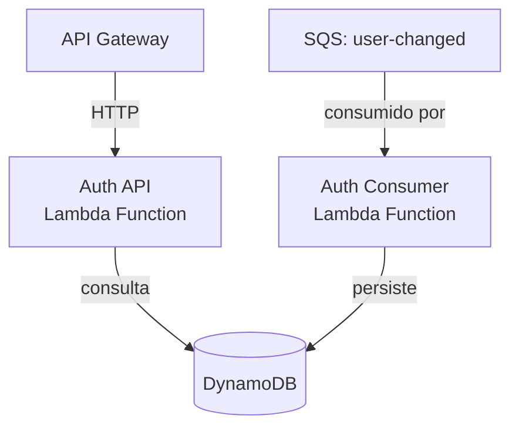
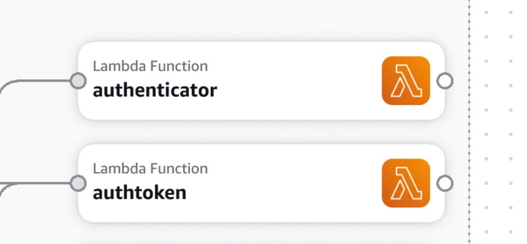

# Auth

Repositório do projeto destinado à geração de tokens JWT para o ecossistema da Oficina Mecânica da FIAP.

Este projeto consulta as tabelas do projeto **Fiap.Mechanics**, portanto, é necessário executar primeiro para rodar as
migrations e garantir a estrutura do banco de dados.

[](http://34.231.107.126/dashboard?id=fiap-mechanics-auth)

## Definição do ambiente

- SDK: .NET 10.0
- Banco de dados: DynamoDB
- Provedor de Segredos: AWS Secrets Manager



> O serviço é composto por duas Lambda Functions independentes: a **Auth API**, responsável pelos
> endpoints de login e geração de tokens, e o **Auth Consumer**, que mantém o DynamoDB sincronizado
> com as alterações de usuários publicadas pelo Identity.

## Messageria

### Consumers

| Fila                                  | Descrição                                                                 |
|---------------------------------------|---------------------------------------------------------------------------|
| `fiap-mechanics-{env}-user-changed`   | Sincroniza os dados de usuário com o DynamoDB.                            |

> A fila é consumida via **Event Source Mapping**, não pela biblioteca `Mechanics.Infra.Messaging`.
> O SQS invoca o Auth Consumer diretamente - não há `IEventConsumer<T>` nem `BackgroundService` neste serviço.

## Pré-requisitos

Para rodar o projeto localmente, é mandatório estar logado e configurado no AWS CLI para que a aplicação consiga
recuperar as chaves de assinatura do JWT:

```powershell
aws configure
```

Execute os scripts do [repositório de infraestrutura](https://github.com/FIAP-POS-TECH-13SOAT-MECHANICS/mechanics-infra)
e do [repositório de banco de dados](https://github.com/FIAP-POS-TECH-13SOAT-MECHANICS/mechanics-database) para
provisionar o ambiente antes de executar a aplicação.

O comando abaixo inicia a API na porta 5050. Utilize uma aplicação como [Postman](https://www.postman.com/downloads)
para testar.

```powershell
dotnet run --project .\src\Mechanics.Auth.Api
```

## Script de deploy

Execute o script Powershell para fazer deploy da aplicação na AWS.
Certifique-se de antes ter provisionado o ambiente usando os scripts
do [repositório de infraestrutura](https://github.com/FIAP-POS-TECH-13SOAT-MECHANICS/mechanics-infra).

```powershell
.\scripts\deploy-function dev all -ApplySeeds
```

O script aceita os seguintes parâmetros:

| Parâmetro      | Valores aceitos          | Padrão | Descrição                                                    |
|----------------|--------------------------|--------|--------------------------------------------------------------|
| `-Environment` | `dev`, `stg`, `prod`     | `dev`  | Ambiente de destino do deploy.                               |
| `-Function`    | `api`, `consumer`, `all` | `all`  | Função a ser publicada. `all` publica a API e o Consumer.    |
| `-ApplySeeds`  | (switch)                 |        | Quando presente, executa os seeds do DynamoDB após o deploy. |

## Acessar via API Gateway

Obtenha a URL da usando o comando abaixo. Adapte o nome de acordo o ambiente.

```powershell
aws apigatewayv2 get-apis --query "Items[?Name=='fiap-mechanics-dev-api'].ApiEndpoint" --output text
```

## Endpoints disponíveis

Para realizar login, utilize o endpoint `POST /auth/login`.

```shell
curl --location 'http://localhost:5050/auth/login' \
--header 'Content-Type: application/json' \
--data '{
    "cpfNumber": "12345678909",
    "password": "5eCre+Key"
}'
```

A resposta contém o token de acesso e o de atualização.
O token de acesso possui uma validade de poucos minutos e pode ser renovado utilizando o token de atualização.

```json
{
    "accessToken": "...",
    "refreshToken": "...",
    "expirationDate": "2025-11-02T00:39:54.1120047+00:00"
}
```

Para renovar o token de acesso, utilize o endpoint `POST /auth/refresh`.

```shell
curl --location 'http://localhost:5050/auth/refresh' \
--header 'accept: application/json' \
--header 'Content-Type: application/json' \
--data '{
  "refreshToken": "..."
}'
```

O token de atualização é válido por 12 horas e é cancelado quando o usuário altera a senha.

## Usuários padrão

Utilize o endpoint `/auth/login` para gerar um token.
O token possui validade de poucos minutos, mas pode ser renovado.

Os seguintes logins podem ser utilizados para testes:

| CPF           | Senha       | Perfil        | Permissões                    |
|---------------|-------------|---------------|-------------------------------|
| `12345678909` | `5eCre+Key` | Administrador | Acesso completo ao sistema    |
| `98765432100` | `5eCre+Key` | Atendente     | Cadastrar clientes e veículos |
| `11144477735` | `5eCre+Key` | Mecânico      | Gerenciar produtos e serviços |

Os dados acima estão disponíveis nos seeds do DynamoDB. Consulte [Seeds](./seeds/README.md) para mais detalhes.

Qualquer funcionário autenticado pode criar e atualizar ordens de serviço.
Para mais detalhes, consulte [Autenticação e autorização](https://github.com/FIAP-POS-TECH-13SOAT-MECHANICS/Mechanics-13soat/blob/main/docs/auth.md).

## Token para serviços

Este endpoint é destinado à comunicação entre microserviços.
Diferente do login de usuários, ele gera um token com a Role `SERVICE`, que permite que um serviço se identifique para
outro dentro do ecossistema.

```shell
curl --location 'http://localhost:5050/auth/service-token' \
--header 'Content-Type: application/json' \
--data '{
    "serviceName": "Mechanics.Orders"
}'
```

O token retornado possui uma validade curta e não gera um `refreshToken`.
Para mais informações, consulte [Integração entre microsserviços](https://github.com/FIAP-POS-TECH-13SOAT-MECHANICS/Mechanics-13soat/blob/main/docs/integration.md).

## Fila de sincronização

O projeto Consumer monitora a fila SQS `user-changed`, publicada pelo
microsserviço [Identity](https://github.com/FIAP-POS-TECH-13SOAT-MECHANICS/mechanics-identity). Cada mensagem contém os
dados de um usuário criado ou alterado no Identity e é processada para manter o DynamoDB do Auth sincronizado.

O Consumer é provisionado como uma Lambda Function separada e associado à fila via Event Source Mapping. O deploy é
realizado pelo mesmo script:

```powershell
.\scripts\deploy-function dev consumer
```

## Diagrama desse projeto




### SonarQube no CI

Este repositório usa workflow reutilizável do `mechanics-infra` para testes e análise SonarQube.

Configurações necessárias em `Settings > Secrets and variables > Actions`:

- Secret `SONAR_HOST_URL`
- Secret `SONAR_TOKEN`
- Variable `SONAR_PROJECT_KEY` (valor: `fiap-mechanics-auth`)

A análise é habilitada em:

- `pull_request` com destino em `main`;
- `workflow_dispatch` quando executado na branch `main`.

O SonarQube faz o coverage da camada de domínio e aplicação. Para isso, o workflow executa os testes com cobertura e publica os resultados usando o SonarScanner.
